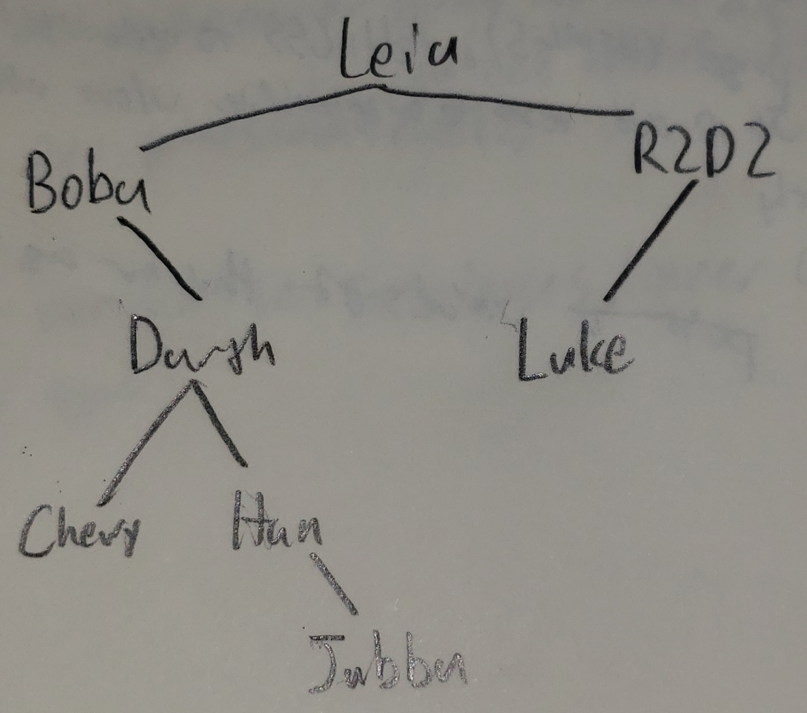
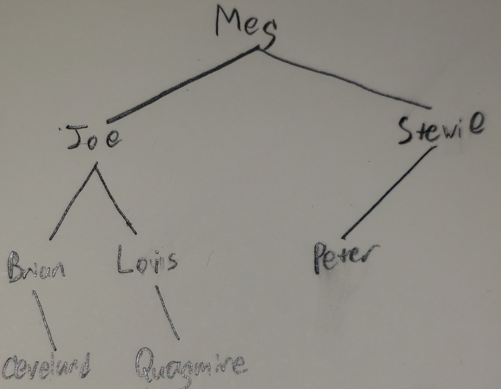
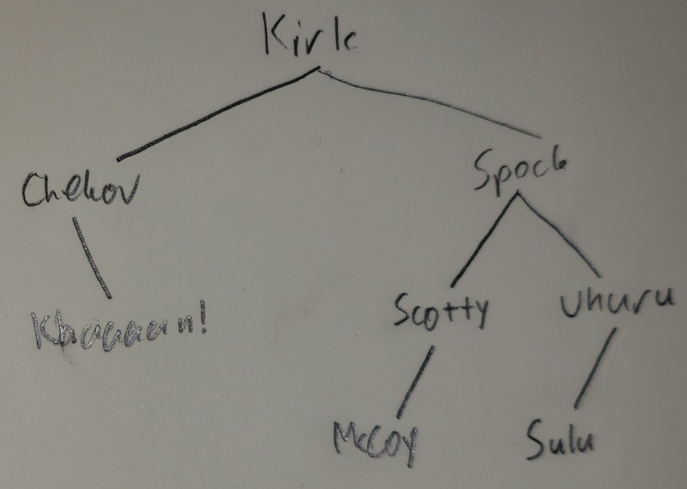
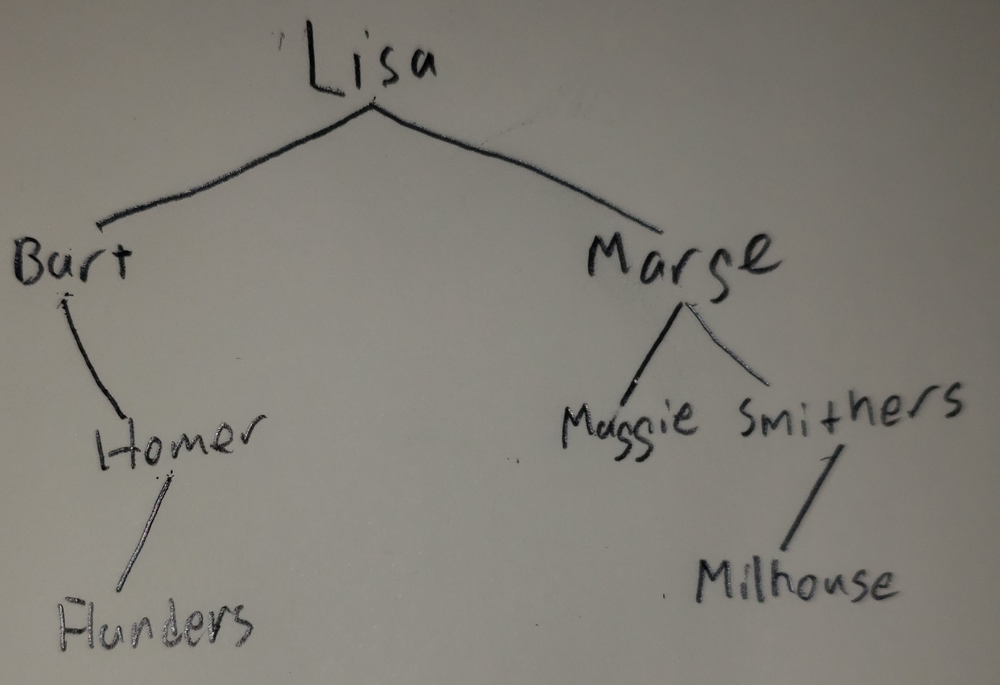

1. A tree has 1 root. There are not necessarily more trees or branches
2.  ```
      *
     ╱ ╲
    *   *
    ```
    ```
        *
       ╱ ╲
      *   *
     ╱
    *
3.  a. 3 \
    b. 3 (`3`, `2`, and `5`) \
    c. 3 (`1`, `4`, and `6`) \
    d. `3` \
    e. Siblings: `5`, Children: `4`, `6`
4.  Preorder: `3, 5, 1, 2, 4, 6` \
    Inorder: `1, 5, 3, 4, 2, 6` \
    Postorder: `1, 5, 4, 6, 2, 3`
5.  Preorder: `3, 47, 23, -2, 55, 63, 94, 28` \
    Inorder: `23, 47, 55, -2, 19, 63, 94, 28` \
    Postorder: `23, 55, -2, 47, 19, 28, 94, 63`
6.  Preorder: `2, 1, 7, 4, 3, 56, 9, 8` \
    Inorder: `2, 1, 3, 4, 5, 7, 1, 6, 8, 9` \
    Postorder: `3, 5, 4, 7, 8, 9, 6, 1, 2`
7. There would be no base case and a `NullPointerException` would be thrown
8. [You did this one for us](https://github.com/liambloom/Java/blob/master/src/devliambloom/softwareEngineering/chapter17/intTree/IntTree.java#L136)
9.  ```java
    public void printMirror() {
        System.out.print("mirror:");
        printMirror(overallRoot);
        System.out.println();
    }

    private void printMirror(IntTreeNode root) {
        if (root != null) {
            printInorder(root.right);
            System.out.print(" " + root.data);
            printInorder(root.left);
        }
    }
    ```
10. Often, you need a recursive method on a tree that acts on a particular node, and calls itself for that node's children. However, you do not want the public method to take in a node, since that shouldn't be publicly exposed in the first place. So the solution is to have a private method that takes a node as an argument and a public method that calls the private one with the root node as that argument.
11. ```java
    // It would be better to simply store the size in a variable and return it
    public int size() {
        return size(overallRoot);
    }

    private int size(IntTreeNode node) {
        return 1 + (this == null ? 0 : size(this.left) + size(this.right));
    }
    ```
12. ```java
    public int min() {
        return min(overallRoot);
    }

    private int min(IntTreeNode node) {
        if (node == null)
            throw new IllegalStateException();
        int min = node.data;
        if (node.left != null)
            min = Math.min(min, min(node.left));
        if (node.right != null)
            min = Math.min(min, min(node.right));
        return min;
    }
    
    public int max() {
        return max(overallRoot);
    }

    private int max(IntTreeNode node) {
        if (node == null)
            throw new IllegalStateException();
        int max = node.data;
        if (node.left != null)
            max = Math.max(max, max(node.left));
        if (node.right != null)
            max = Math.max(max, max(node.right));
        return max;
    }
    ```
    ```rust 
    // This is the code in rust, using a macro to make it less repetitive
    use paste::paste;

    macro_rules! min_max {
        ($($ident:ident),*) => {
            $(
                paste! {
                    pub fn $ident(&self) -> i32 {
                        match &self.overall_root {
                            Some(root) => Self::[<$ident _inner>](root),
                            None => panic!("Empty list!")
                        }
                    }
                    
                    fn [<$ident _inner>](root: &IntTreeNode) -> i32 {
                        use std::cmp::$ident;
            
                        let mut extrema: i32 = root.data;
                        if let Some(data) = &root.left {
                            extrema = $ident(extrema, Self::[<$ident _inner>](&*data));
                        }
                        if let Some(data) = &root.right {
                            extrema = $ident(extrema, Self::[<$ident _inner>](&*data));
                        }
                        extrema
                    }   
                }
            )*
        }
    }

    impl IntTree {
        min_max!(min, max);
    }
    ```
13. ```java
    public int countBranches() {
        return overallRoot == null ? 0 : countBranches(overallRoot);
    }

    private int countBranches(IntTreeNode node) {
        return node.left == null && node.right == null ?
            0 : 1 + countBranches(node.left) + countBranches(node.right);
    }
    ```
14. A binary search tree is a type of binary tree. A binary search tree has all the properties of a normal binary tree, but with the additional property that the element are sorted so that the left node is always less than its parent and the right node is always greater. How duplicates are handled doesn't matter as long as it's consistent, although the examples in this chapter put them on the left.
15. b*, c, e. (*b would break the rules set forth in this chapter, but it's not necessarily invalid)
16. The elements will be in order
17.  \
    Preorder: Leia, Boba, Darth, Chewy, Han, Jabba, R2D2, Luke \
    Inorder: Boba, Chewy, Darth, Han, Jabba, Leia, Luke, R2D2 \
    Postorder: Chewy, Jabba, Han, Darth, Boba, Luke, R2D2, Leia
18.  \
    Preorder: Meg, Joe, Brian, Cleveland, Lois, Quagmire, Stewie, Peter \
    Inorder: Brian, Cleveland, Joe, Lois, Quagmire, Meg, Stewie, Peter \
    PostOrder: Cleveland, Brian, Quagmire, Lois, Joe, Peter, Stewie, Meg
19.  \
    Preorder: Kirk, Chekov, Khaaaan!, Spock, Scotty, McCoy, Uhuru, Sulu \
    Inorder: Chekov, Khaaaan!, Kirk, McCoy, Scotty, Spock, Sulu, Uhuru \
    Postorder: Khaaaan!, Chekov, McCoy, Scotty, Sulu, Uhuru, Spock, Kirk
20.  \
    Preorder: Lisa, Bart, Homer, Flanders, Marge, Maggie, Smithers, Milhouse \
    Inorder: Bart, Flanders, Homer, Lisa, Maggie, Marge, Milhouse, Smithers \
    Postorder: Flanders, Homer, Bart, Maggie, Milhouse, Smithers, Marge, Lisa
21. So that it is able to set the root
22. It is a pattern where a variable is set to the return of a method for which that variable is also an argument. It is used in binary trees to allow a method to modify one of its parameters, generally a parent node.
23. No more than `N`
24. It is worse than the implementation in the chapter because, although they both work, the one in the chapter checks far fewer nodes. If `n` is the number of nodes in the tree, then this one has a time complexity of `O(n)` while the one in the chapter is only `O(log n)`.
25. ```java
    public int min() {
        if (overallRoot == null)
            throw new IllegalStateException();
        return min(overallRoot);
    }

    private int min(IntTreeNode node) {
        return node.left == null ? node.data : min(node.left);
    }

    public int max() {
        if (overallRoot == null)
            throw new IllegalStateException();
        return max(overallRoot);
    }

    private int max(IntTreeNode node) {
        return node.right == null ? node.data : max(node.right)
    }
    ```
