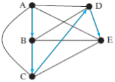
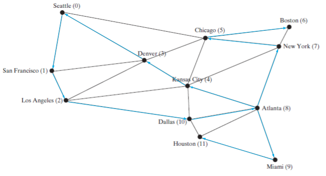
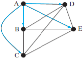
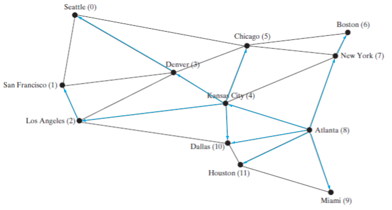

### 28.1 
It is a problem that was solved by Euler, and was the foundation of graph theory

### 28.2 
<dl>
<dt>Undirected Graph</dt>
<dd>A graph in which edges do not point in one direction or another</dd>
<dt>Directed Graph</dt>
<dd>A graph in which edges have a direction</dd>
<dt>Weighted Graph</dt>
<dd>A graph in which some edges are weighted more heavily than others</dd>
<dt>Unweighted Graph</dt>
<dd>A graph in which all edges have the same "weight"</dd>
<dt>Degree of a Vertex</dt>
<dd>The number of edges it connects to</dd>
<dt>Parallel Edge</dt>
<dd>Two edges between the same two vertexes</dd>
<dt>Simple Graph</dt>
<dd>A graph with no loops or parallel edges</dd>
<dt>Complete Graph</dt>
<dd>Every pair of points in connected</dd>
<dt>Connected Graph</dt>
<dd>A graph in which there is a path between any two points</dd>
<dt>Cycle</dt>
<dd>A closed path that starts and ends on the same vertex</dd>
<dt>Subgraph</dt>
<dd>A graph in which the vertices and edges are both subsets of another graph</dd>
<dt>Tree</dt>
<dd>A graph in which has no cycles</dd>
<dt>Spanning Tree</dt>
<dd>A connected subgraph that is a tree</dd>
</dl>

### 28.3 
10, 4

### 28.4 
&half;*n*<sup>2</sup>-&half;*n*, *n*-1

### 28.5 
- Vertices are stored in an array
- Edge arrays are a representation of edges that is a n by 2 matrix in which each 2-long array holds the start and end indices of an edge
- Edge objects are like edge arrays, but each element is an `Edge` object instead of an array with length 2
- Adjacency matrices are n by n matrices where each element m<sub>a, b</sub> is the number of edges connecting verteces a and b
- Adjacency lists are an array of lists in which a<sub>i</sub> is a `List` of indices of the either the vertices or edges (for array vertex lists and array edge lists respectively) connected to the vertex at index i.

### 28.6
- Edge Array: `{{0, 1}, {0, 2}, {0, 3} ... {2, 4}, {3, 4}, {3, 5}}`
- Edge Object: `{Edge(0, 1), Edge(0, 2), Edge(0, 3) ... Edge(2, 4), Edge(3, 4), Edge(3, 5)}`
- Adjacency Matrix: 
    ```
    {
        { 0, 1, 1, 1, 1, 1 },
        { 1, 0, 1, 1, 1, 0 },
        { 1, 1, 0, 1, 1, 0 },
        { 1, 1, 1, 0, 1, 1 },
        { 1, 1, 1, 1, 0, 0 },
        { 1, 0, 0, 1, 0, 0 }
    }
    ```
- Adjacency Vertex List
    ```
    {
        [1, 2, 3, 4, 5],
        [0, 2, 3, 4],
        [0, 1, 4, 5],
        [0, 1, 2, 4, 5],
        [0, 1, 2, 3],
        [0, 3]
    }
    ```
- Adjacency Edge List
    ```
    {
        [Edge(0, 1), Edge(0, 2), Edge(0, 3), Edge(0, 4), Edge(0, 5)],
        [Edge(1, 0), Edge(1, 2), Edge(1, 3), Edge(1, 4)],
        [Edge(2, 0), Edge(2, 1), Edge(2, 4), Edge(2, 5)],
        [Edge(3, 0), Edge(3, 1), Edge(3, 2), Edge(3, 4), Edge(3, 5)],
        [Edge(4, 0), Edge(4, 1), Edge(4, 2), Edge(4, 3)],
        [Edge(5, 0), Edge(5, 3)]
    }
    ```

### 28.7 
`AbstractGraph implements Graph` and `UnweightedGraph extends AbstractGraph`. Within the data types, `Graph` is an interface, and as such holds no data. `AbstractGraph` has a `List` of vertices and an adjacency edge list to hold the edges.

### 28.8 
```java
graph1.getIndex("Seattle"); // Gets the index of the vertex "Seattle"
graph1.getDegree(5); // Gets the degree of the vertex at index 5
graph1.getVertex(4); // Gets the vertex at index 4
```

### 28.9 
Yes, so long as there are no loops in the graph

### 28.10 
No, because string doesn't implement displayable. (There is another thing that I like better about rust. If you create a trait (like an interface), you can implement it on foreign types).

### 28.11 
No, it does not implement all the methods from `Tree`

### 28.12 
`getParent(index: int): int`

### 28.13 
A search algorithm that checks outward before backtracking

### 28.14


### 28.15
DFS starting from atlanta


### 28.16
`Tree`

### 28.17
Problems:
- The root node is visited twice
- No tree is ever created

Correct implementation:
```
Tree dfs(vertex v) {
    push v into the stack;
    visit v;
    while (the stack is not empty) {
        pop a vertex, say u, from the stack
        for each neighbor w of u
            if (w has not been visited)
                push w into the stack;
                set u as parent for w in the tree;
    }
}
```

### 28.21
`Tree`

### 28.22
A search algorithm that nodes level by level

### 28.23


### 28.24


### 28.25
BFS gave me a rout between two nodes that was <var>n</var> long, I would know that was the shortest possible root because if a root of &lt;<var>n</var> existed, it would have been found first, since BFS searches layer by layer