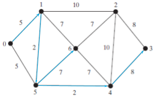
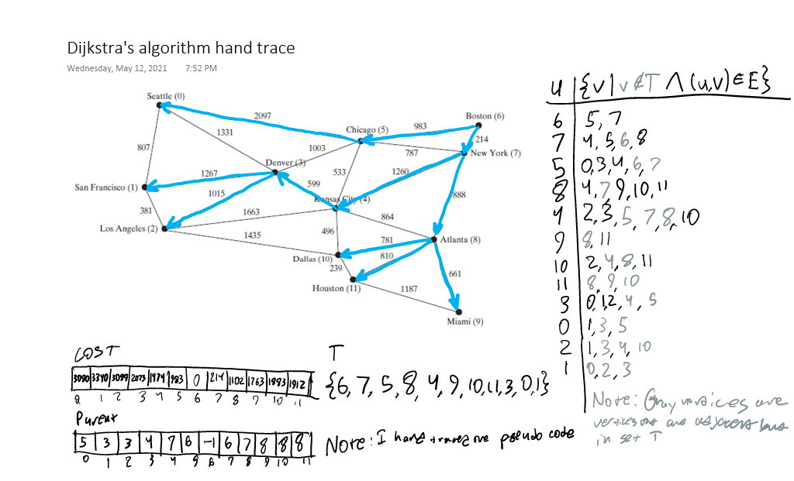

### 29.1
`edge.u = 1` is vertex `u`
`edge.v = 2` is vertex `v`
`edge.weight = 3.5` is the weight of the edge

### 29.2
```
2
3
4.5
```

### 29.3
```
1.5
3.5
6.5
```

### 29.4
The problem with the code is that the list has a length of 0, there is nothing in it. This can be fixed by replacing the first line with
```java
List<PriorityQueue<WeightedEdge>> = Stream.generate(LinkedList::new)
    .limit(2)
    .collect(Collectors.toList());
```
and the output of this fixed program would be:
```
-1
```

### 29.5


### 29.6
Yes

### 29.7
O(n<sup>3</sup>)

### 29.8
It runs infinitely. A solution (not a particularly efficient solution, but a solution nonetheless) is that you could call a search method from last chapter to find how many continuous nodes there are, instead of calling `getSize()`.

### 29.9


### 29.10
No

### 29.11
O(n<sup>3</sup>)

### 29.12
Same as [29.8](#29.8)

### 29.13
The highest possible value. Preferably &infin;, although it may be lower if the data type of the elements of `cost` don't support infinity (for example, if `cost` is and `int[]`, the vertices with no path will have a cost of `Integer.MAX_VALUE=2,147,483,647`).

### 29.14
No, because all the vertices will start out with a cost of 0, which will mean that the shortest path between any two vertices will be 0.

### 29.15
This makes it so extending classes, such as `WeightedNineTailModel`, can access it.

### 29.16
By calling a method in the superclass `NineTailModel`.

### 29.17
By iterating over all the nodes and creating edges for them based on the number of flips.